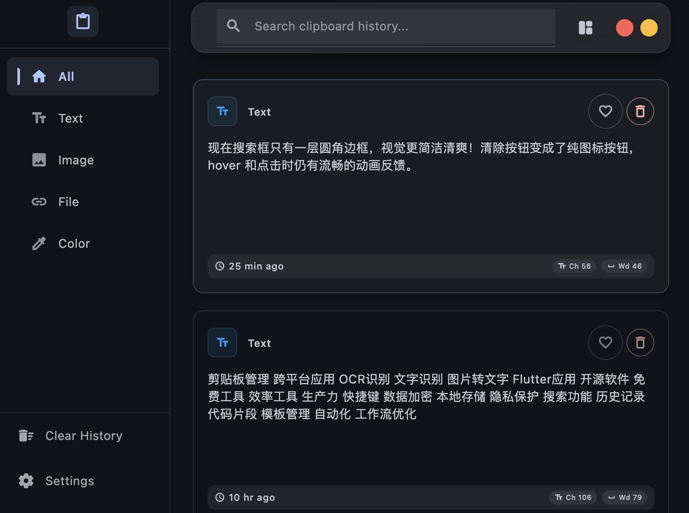
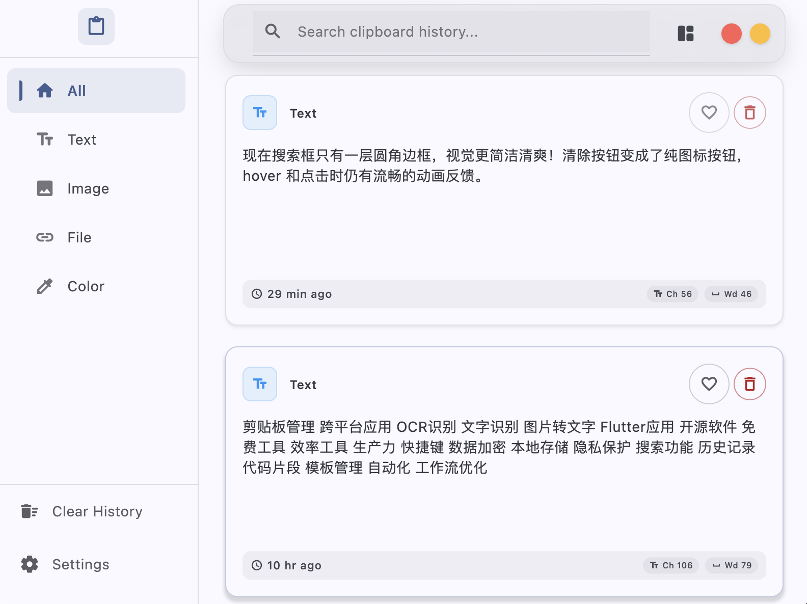
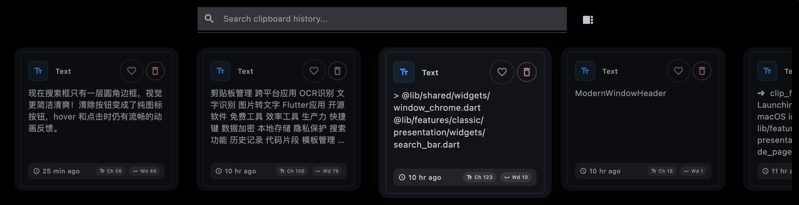
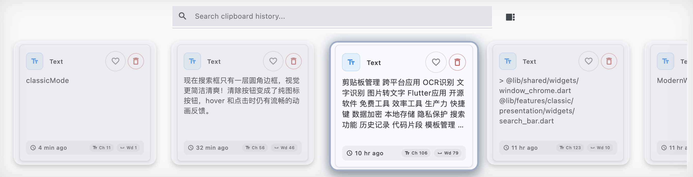
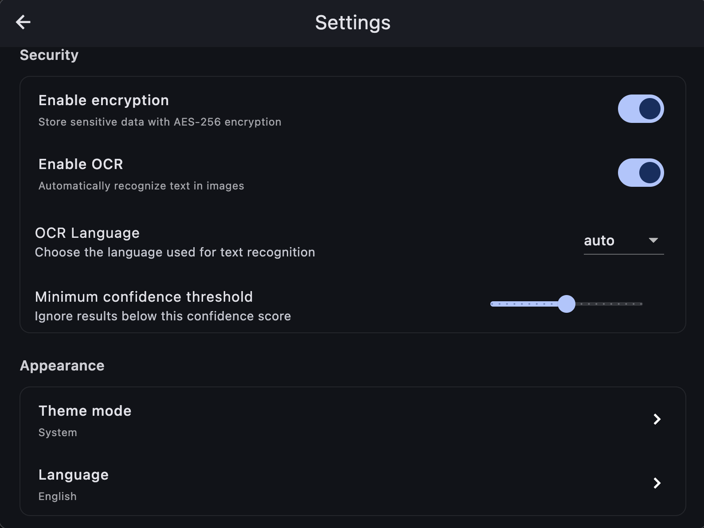

# ClipFlow - 跨平台剪贴板历史管理工具

[](https://flutter.dev/)
[](https://dart.dev/)
[](LICENSE)
[](https://github.com/devSkills1/clip_flow)

一款现代化的智能剪贴板历史管理工具，支持 Mac、Windows 和 Linux。基于 Flutter 开发，提供极简、极速、全类型的剪贴板管理体验。

## 核心特性

### 全能剪贴板管理
- **多格式支持** - 文本、富文本(RTF/HTML)、颜色、图片、代码、JSON、XML、URL、邮箱、文件等
- **智能识别** - 自动识别内容类型，提取元数据，支持 MIME 检测
- **标签管理** - 收藏重要内容，分类管理历史记录

### 极速性能
- **实时监听** - 毫秒级剪贴板变化检测
- **智能去重** - LRU 缓存 + 哈希去重，节省内存
- **异步处理** - 多线程队列，保持界面流畅

### 双模式界面
- **经典模式** - 时间线布局，完整功能展示
- **紧凑模式** - 模糊背景，横向卡片，快捷键导航
- **智能搜索** - 实时搜索、类型筛选、日期范围、收藏过滤
- **响应式设计** - 自适应屏幕尺寸，1-4 列网格布局

### 用户体验
- **窗口管理** - 托盘集成、自动隐藏、热键唤醒
- **快捷键** - 完全自定义，支持全局热键
- **OCR 识别** - 图片文字提取，支持多语言
- **数据加密** - AES-256-GCM 加密保护隐私
- **国际化** - 中文/英文双语支持

## 快速开始

### 系统要求

| 平台 | 最低版本 | 备注 |
|------|----------|------|
| **macOS** | 10.15+ | 需要辅助功能权限 |
| **Windows** | 10+ | 支持 x64 架构 |
| **Linux** | Ubuntu 18.04+ | 需要 GTK 依赖 |

> 主要在 macOS 平台开发和测试，Windows/Linux 部分功能欢迎社区贡献完善。

### 安装

#### 下载预编译版本（推荐）

直接下载对应平台的安装包：
- macOS: `ClipFlow.dmg`
- Windows: `ClipFlow.exe`
- Linux: `ClipFlow.AppImage`

#### 从源码构建

```bash
# 克隆项目
git clone https://github.com/devSkills1/clip_flow.git
cd clip_flow

# 安装依赖
flutter pub get

# 运行开发版本
flutter run

# 构建发布版本
flutter build macos    # macOS
flutter build windows  # Windows
flutter build linux    # Linux
```

### 配置

#### macOS 权限设置
1. 打开 **系统偏好设置** > **安全性与隐私** > **隐私**
2. 选择 **辅助功能**，点击 **+** 添加 ClipFlow
3. 重启应用

#### Linux 依赖安装
```bash
sudo apt-get install clang cmake ninja-build pkg-config libgtk-3-dev liblzma-dev
flutter config --enable-linux-desktop
```

## 使用指南

### 快捷键

| 功能 | macOS | Windows/Linux |
|------|-------|--------------|
| 显示/隐藏主窗口 | `Cmd + Option + \`` | `Ctrl + Alt + \`` |
| 快速粘贴最新项 | `Cmd + Ctrl + V` | `Ctrl + Win + V` |
| 显示剪贴板历史 | `Cmd + F9` | `Ctrl + F9` |
| 搜索剪贴板内容 | `Cmd + Shift + F` | `Ctrl + Shift + F` |
| OCR 文字识别 | `Cmd + F8` | `Ctrl + F8` |

### 核心功能

1. **自动监听** - 启动即用，自动捕获剪贴板内容
2. **模式切换** - 通过设置或快捷键切换经典/紧凑模式
3. **智能搜索** - 支持内容类型、时间范围、收藏状态筛选
4. **收藏管理** - 重要内容永久保存，支持批量操作
5. **OCR 识别** - 提取图片中的文字内容

## 界面预览

### 经典模式



### 紧凑模式



### 设置界面


## 技术栈

- **Flutter 3.19+** - 跨平台框架
- **Riverpod 3.0** - 状态管理
- **SQLite** - 本地数据库
- **AES-256-GCM** - 数据加密
- **Clean Architecture** - 架构模式

## 开发

```bash
# 代码分析
flutter analyze

# 格式化
dart format .

# 运行测试
flutter test --coverage

# 生成国际化文件
flutter gen-l10n

# 构建脚本
./scripts/build.sh          # 构建发布版本
./scripts/build.sh --dmg    # 构建 macOS DMG
./scripts/build.sh --clean  # 清理缓存
```

## 项目状态

### 当前版本：v1.0.0

- 核心功能完成：剪贴板监听、数据库存储、OCR 识别、快捷键系统
- 跨平台支持：macOS、Windows、Linux 三端构建成功
- 性能优化：智能缓存、批量操作、内存管理优化
- 用户体验：Material Design 3 界面、国际化支持、错误监控
- 架构重构：模块化服务层、端口接口设计

## 贡献指南

欢迎所有形式的贡献！

1. Fork 项目
2. 创建功能分支 (`git checkout -b feature/amazing-feature`)
3. 提交更改 (`git commit -m 'feat: add amazing feature'`)
4. 推送到分支 (`git push origin feature/amazing-feature`)
5. 创建 Pull Request

## 对比其他工具

| 特性 | ClipFlow | Alfred | Paste | Raycast |
|------|----------|--------|-------|---------|
| 开源免费 | ✅ | ❌ | ❌ | ❌ |
| 跨平台支持 | ✅ | ❌ 仅macOS | ❌ 仅macOS | ❌ 仅macOS |
| OCR 识别 | ✅ | ❌ | ✅ | ✅ |
| 隐私保护 | ✅ 本地存储 | ⚠️ 部分云端 | ⚠️ 部分云端 | ⚠️ 部分云端 |

## 适用场景

- **办公人群** - 文案编辑、数据分析、邮件回复、多任务处理
- **开发者** - 代码片段管理、API 文档查阅、错误日志分析
- **创意设计** - 设计素材收集、灵感记录、OCR 文字提取
- **学习研究** - 资料收集、笔记整理、多语言学习

## 许可证

MIT License - 查看 [LICENSE](LICENSE) 文件了解详情

## 联系方式

- 项目主页：https://github.com/devSkills1/clip_flow
- 问题反馈：https://github.com/devSkills1/clip_flow/issues

## 致谢

- [Flutter](https://flutter.dev/) - 跨平台开发框架
- [Riverpod](https://riverpod.dev/) - 状态管理
- [Claude Code](https://claude.ai/code) - AI 辅助开发工具
