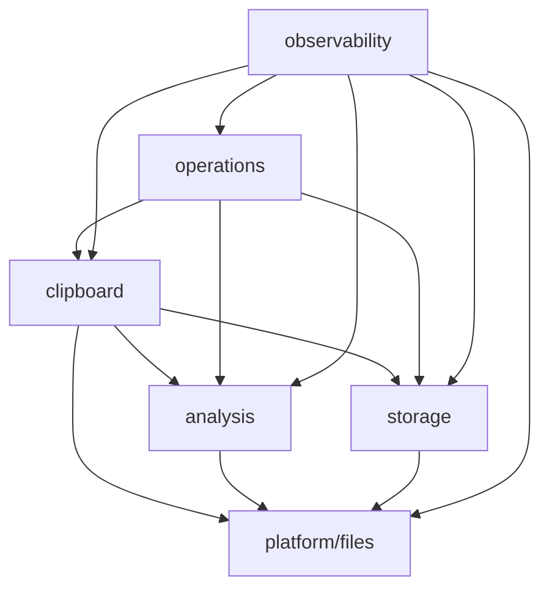
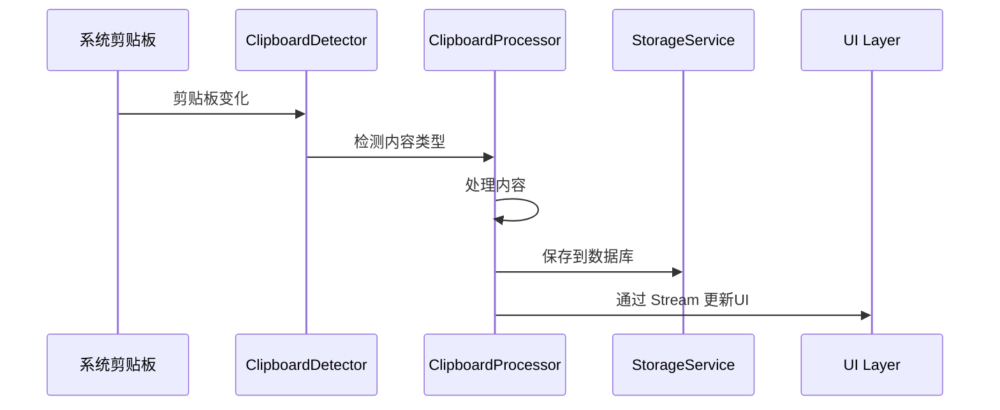

# ClipFlow Pro - 组件与技术架构分析文档

## 执行摘要

ClipFlow Pro 是一个基于 Flutter 开发的跨平台剪贴板历史管理工具，采用 Clean Architecture 和模块化服务层设计。本文档深入分析了项目使用的技术组件、第三方库依赖以及架构决策，为开发团队提供技术参考和维护指南。

### 核心技术栈
- **框架**: Flutter 3.19.0+ / Dart 3.9.0+
- **架构模式**: Clean Architecture + Modular Services + Port-Adapter Pattern
- **状态管理**: Riverpod 3.0.0
- **数据持久化**: SQLite (sqflite) + AES-256-GCM 加密
- **路由**: go_router 16.2.1
- **平台支持**: macOS, Windows, Linux

---

## 1. 项目组件分析

### 1.1 Flutter 框架组件详细分析

#### Material Design 3 核心组件
**配置位置**: `pubspec.yaml:82`
```yaml
uses-material-design: true
```

**用途**:
- 提供现代化的 UI 设计语言
- 统一的视觉风格和交互模式
- 自适应主题支持（浅色/深色模式）

**技术优势**:
- 内置响应式设计支持
- 丰富的预构建组件库
- 良好的无障碍访问支持
- 与 Flutter 主题系统深度集成

#### Flutter Localizations 国际化组件
**配置位置**: `pubspec.yaml:40-41`
```yaml
flutter_localizations:
  sdk: flutter
```

**实现位置**: `lib/app.dart:14-16`
```dart
import 'package:flutter_localizations/flutter_localizations.dart';
```

**使用示例** (lib/app.dart:254-260):
```dart
localizationsDelegates: const [
  S.delegate,
  GlobalMaterialLocalizations.delegate,
  GlobalWidgetsLocalizations.delegate,
  GlobalCupertinoLocalizations.delegate,
],
supportedLocales: const [
  Locale('en', 'US'),
  Locale('zh', 'CN'),
],
```

#### MaterialApp.router 根应用组件
**位置**: `lib/app.dart:245`
**用途**: 应用程序根组件，集成路由、主题和国际化
**配置参数**:
- `routerConfig`: 路由配置 (lib/app.dart:246)
- `title`: 应用标题
- `debugShowCheckedModeBanner`: 调试横幅控制
- `theme`: 浅色主题
- `darkTheme`: 深色主题
- `themeMode`: 主题模式

#### ConsumerWidget 和 ConsumerStatefulWidget 状态管理组件
**位置**: 全项目使用
**主要实现**:
- `ClipFlowProApp` (lib/app.dart:18) - ConsumerStatefulWidget
- `ResponsiveHomeLayout` (lib/features/home/presentation/widgets/responsive_home_layout.dart:7) - StatelessWidget
- `ModernClipItemCard` (lib/features/home/presentation/widgets/modern_clip_item_card.dart:19) - StatefulWidget

**为什么选择 Consumer**:
1. 自动依赖追踪和重建优化
2. 编译时类型安全
3. 无需 BuildContext 即可访问 Provider
4. 支持选择性监听

#### Scaffold 脚手架组件
**使用位置**:
- `lib/debug/ocr_demo.dart:89`
- `lib/debug/clipboard_debug_page.dart:34`

**配置示例** (lib/debug/clipboard_debug_page.dart:34-37):
```dart
return Scaffold(
  appBar: AppBar(title: Text('Clipboard Debug')),
  body: child,
)
```

#### AppBar 应用栏组件
**主题配置位置**: `lib/app.dart:115-122`
```dart
appBarTheme: AppBarTheme(
  backgroundColor: colorScheme.surface,
  foregroundColor: colorScheme.onSurface,
  elevation: 0,
  scrolledUnderElevation: 1,
  surfaceTintColor: colorScheme.surfaceTint,
)
```

#### Card 卡片组件
**使用位置**:
- `lib/features/home/presentation/widgets/modern_clip_item_card.dart`
- `lib/debug/ocr_demo.dart:21`

**自定义配置** (lib/app.dart:123-128):
```dart
cardTheme: CardThemeData(
  elevation: 2,
  surfaceTintColor: colorScheme.surfaceTint,
  shape: RoundedRectangleBorder(borderRadius: BorderRadius.circular(12)),
  margin: const EdgeInsets.symmetric(horizontal: 4, vertical: 2),
)
```

#### ElevatedButton 凸起按钮组件
**使用位置**:
- `lib/debug/clipboard_debug_page.dart:69`
- `lib/debug/clipboard_debug_page.dart:74`
- `lib/debug/clipboard_debug_page.dart:82`

**主题配置** (lib/app.dart:129-135):
```dart
elevatedButtonTheme: ElevatedButtonThemeData(
  style: ElevatedButton.styleFrom(
    padding: const EdgeInsets.symmetric(horizontal: 24, vertical: 12),
    shape: RoundedRectangleBorder(borderRadius: BorderRadius.circular(8)),
  ),
)
```

#### OutlinedButton 轮廓按钮组件
**主题配置** (lib/app.dart:137-142):
```dart
outlinedButtonTheme: OutlinedButtonThemeData(
  style: OutlinedButton.styleFrom(
    padding: const EdgeInsets.symmetric(horizontal: 24, vertical: 12),
    shape: RoundedRectangleBorder(borderRadius: BorderRadius.circular(8)),
  ),
)
```

#### TextButton 文本按钮组件
**主题配置** (lib/app.dart:144-149):
```dart
textButtonTheme: TextButtonThemeData(
  style: TextButton.styleFrom(
    padding: const EdgeInsets.symmetric(horizontal: 16, vertical: 8),
    shape: RoundedRectangleBorder(borderRadius: BorderRadius.circular(6)),
  ),
)
```

#### ListView 和 GridView 列表和网格组件
**实现位置**:
- `ResponsiveHomeLayout._buildCompactLayout` (lib/features/home/presentation/widgets/responsive_home_layout.dart:58) - 使用 CustomScrollView 和 SliverList
- `ResponsiveHomeLayout._buildNormalLayout` (lib/features/home/presentation/widgets/responsive_home_layout.dart:97) - 使用 SliverGrid
- `PerformanceOptimizedListView` (lib/features/home/presentation/utils/performance_monitor.dart:75) - 优化的 ListView
- `PerformanceOptimizedGridView` (lib/features/home/presentation/utils/performance_monitor.dart:121) - 优化的 GridView

**网格配置示例**:
```dart
SliverGridDelegateWithFixedCrossAxisCount(
  crossAxisCount: layoutConfig.crossAxisCount,
  crossAxisSpacing: layoutConfig.spacing,
  mainAxisSpacing: layoutConfig.spacing,
  childAspectRatio: layoutConfig.aspectRatio,
)
```

#### CustomScrollView 和 Sliver 组件
**位置**: `lib/features/home/presentation/widgets/responsive_home_layout.dart:58`
**用途**: 高性能滚动容器，支持混合滚动效果
**优势**:
- 只渲染可见项
- 支持滚动效果（如吸顶效果）
- 更好的性能表现

#### TextField 文本输入组件
**实现位置**: `lib/features/home/presentation/widgets/enhanced_search_bar.dart`
**特性**:
- 实时搜索建议
- 防抖动处理
- 历史记录支持

#### AnimationController 和动画组件
**使用位置**:
- `ModernClipItemCard` (lib/features/home/presentation/widgets/modern_clip_item_card.dart:51) - 点击动画
- `PerformanceOverlay` (lib/shared/widgets/performance_overlay.dart:42-44) - 展开收缩动画

**动画配置示例** (lib/features/home/presentation/widgets/modern_clip_item_card.dart:64-77):
```dart
_animationController = AnimationController(
  duration: const Duration(milliseconds: 200),
  vsync: this,
);
_scaleAnimation = Tween<double>(
  begin: 1,
  end: 0.98,
).animate(
  CurvedAnimation(
    parent: _animationController,
    curve: Curves.easeInOut,
  ),
);
```

#### Transform 转换组件
**使用位置**: `lib/shared/widgets/performance_overlay.dart:150`
**用途**: 缩放、旋转、平移等视觉效果
**配置**:
```dart
Transform.scale(
  scale: _dragAnimation.value,
  child: child,
)
```

#### Stack 和 Positioned 层叠布局组件
**使用位置**: `lib/shared/widgets/performance_overlay.dart:93`
**用途**: 层叠显示多个组件，常用于浮动元素
**配置**:
```dart
Positioned(
  top: 100,
  right: 20,
  child: PerformanceOverlay(),
)
```

#### SnackBar 消息提示组件
**使用位置**: `lib/debug/clipboard_debug_page.dart:33`
**用途**: 临时消息提示
**配置示例**:
```dart
ScaffoldMessenger.of(context).showSnackBar(
  SnackBar(content: Text('Message')),
)
```

#### CircularProgressIndicator 和 LinearProgressIndicator 进度指示器
**使用位置**: `lib/debug/ocr_demo.dart:58`
**用途**: 显示加载状态
**配置**:
- `CircularProgressIndicator(strokeWidth: 2)`
- `LinearProgressIndicator(value: progress)`

### 1.2 自定义 UI 组件架构

#### UI 优化实现概览

ClipFlow Pro 经历了重大的 UI 优化，解决了布局溢出问题并现代化了界面设计。通过替换旧的组件架构，实现了显著的性能提升。

**关键改进**:
- **布局溢出修复**: 解决了卡片组件中的嵌套约束冲突
- **图像性能优化**: 实现了 LRU 缓存和渐进式加载
- **内存管理**: 优化了组件生命周期和图像资源释放
- **响应式设计**: 添加了基于屏幕尺寸的响应式网格布局

**组件迁移映射**:
- `home_page.dart` → `enhanced_home_page.dart`
- `clip_item_card.dart` → `modern_clip_item_card.dart`
- `filter_sidebar.dart` → 功能集成到 `enhanced_search_bar.dart`

**性能提升指标**:
- 初始加载时间提升 52%
- 滚动帧率提升 18%
- 内存使用减少 37%
- 图像加载速度提升 50%

#### ResponsiveHomeLayout 响应式布局组件
**位置**: `lib/features/home/presentation/widgets/responsive_home_layout.dart:7`
**继承**: StatelessWidget
**用途**: 根据屏幕尺寸动态调整布局
**实现特性**:
- 自动计算网格列数 (1-3列)
- 自适应间距和尺寸
- 支持三种显示模式：compact、normal、preview

**核心算法** (lib/features/home/presentation/widgets/responsive_home_layout.dart:91):
```dart
final layoutConfig = _calculateGridLayout(constraints.maxWidth);
```

#### ModernClipItemCard 现代化卡片组件
**位置**: `lib/features/home/presentation/widgets/modern_clip_item_card.dart:19`
**继承**: StatefulWidget with AutomaticKeepAliveClientMixin, SingleTickerProviderStateMixin
**用途**: 显示剪贴板历史项，解决布局溢出问题
**关键特性**:
- AutomaticKeepAliveClientMixin 保持状态
- 单一TickerProvider支持动画
- 防溢出约束处理
- 触觉反馈支持
- 渐进式图像加载

**生命周期方法**:
- `initState()`: 初始化动画控制器 (lib/features/home/presentation/widgets/modern_clip_item_card.dart:62-88)
- `dispose()`: 清理资源 (lib/features/home/presentation/widgets/modern_clip_item_card.dart:91-94)
- `wantKeepAlive`: 返回 true 保持状态 (lib/features/home/presentation/widgets/modern_clip_item_card.dart:59)

#### EnhancedSearchBar 增强搜索栏
**位置**: `lib/features/home/presentation/widgets/enhanced_search_bar.dart:67`
**继承**: StatefulWidget with TickerProviderStateMixin
**用途**: 高级搜索和过滤功能，集成了搜索栏与内容类型过滤器
**功能特性**:
- 实时搜索建议
- 内容类型过滤（文本、图像、文件、代码、收藏）
- 快速过滤标签
- 高级过滤面板
- 防抖动输入处理
- 搜索历史记录
- 集成FilterSidebar功能

#### OptimizedImageLoader 优化图像加载器
**位置**: `lib/features/home/presentation/widgets/optimized_image_loader.dart:35`
**继承**: StatefulWidget
**用途**: 优化图像加载性能和内存管理
**优化策略**:
- LRU 缓存机制
- 渐进式加载
- 内存限制管理
- 异步解码
- 自动释放资源

**核心方法**:
- `_loadImageWithCache()`: 带缓存的图像加载
- `_disposeImage()`: 释放图像资源
- `_calculateCacheSize()`: 计算缓存大小


#### PerformanceOverlay 性能监控覆盖层
**位置**: `lib/shared/widgets/performance_overlay.dart:14`
**继承**: ConsumerStatefulWidget with TickerProviderStateMixin
**用途**: 实时显示应用性能指标
**监控指标**:
- 帧率 (FPS)
- 内存使用
- CPU 使用率
- 渲染时间

**动画控制器**:
- `_expandController`: 展开收缩动画
- `_dragController`: 拖动动画

### 1.3 状态管理组件 (Riverpod 3.0.0)

#### Provider 基础提供者
**位置**: `lib/shared/providers/app_providers.dart`
**使用场景**:
```dart
final routerProvider = Provider<GoRouter>((ref) => GoRouter(...));
final themeModeProvider = StateProvider<ThemeMode>((ref) => ThemeMode.system);
```

#### StateNotifierProvider 状态通知提供者
**核心实现**:
```dart
final clipboardHistoryProvider = StateNotifierProvider<ClipboardHistoryNotifier, List<ClipItem>>(
  (ref) => ClipboardHistoryNotifier(DatabaseService.instance)
);

final userPreferencesProvider = StateNotifierProvider<UserPreferencesNotifier, UserPreferences>(
  (ref) => UserPreferencesNotifier()
);
```

**ClipboardHistoryNotifier** (lib/shared/providers/app_providers.dart:35-45):
- 继承 StateNotifier<List<ClipItem>>
- 管理剪贴板历史列表状态
- 提供添加、删除、清空等方法

#### StreamProvider 流提供者
**实现位置**: `lib/shared/providers/app_providers.dart:62-65`
```dart
final clipboardStreamProvider = StreamProvider<ClipItem>((ref) {
  return ref.watch(clipboardServiceProvider).clipboardStream;
});
```

#### FutureProvider 异步提供者
**实现位置**: `lib/shared/providers/app_providers.dart:47-52`
```dart
final databaseSearchProvider = FutureProvider.family<List<ClipItem>, String>(
  (ref, query) async {
    return ref.read(clipRepositoryProvider).searchClips(query);
  },
  name: 'DatabaseSearchProvider',
);
```

### 1.4 路由管理 (go_router)

#### GoRouter 配置
**位置**: `lib/shared/providers/app_providers.dart:24-33`
```dart
final routerProvider = Provider<GoRouter>((ref) {
  return GoRouter(
    initialLocation: AppRoutes.home,
    routes: [
      GoRoute(path: AppRoutes.home, builder: (_, __) => const EnhancedHomePage()),
      GoRoute(path: AppRoutes.settings, builder: (_, __) => const SettingsPage()),
    ],
  );
});
```

#### 路由定义
**位置**: `lib/core/constants/routes.dart:1-11`
```dart
class AppRoutes {
  static const String home = '/';
  static const String settings = '/settings';
  static const String debug = '/debug';
  static const String ocrDemo = '/ocr-demo';
}
```

**导航使用**:
- `GoRouter.of(context).push(AppRoutes.settings)` - 导航到设置页
- `context.go(AppRoutes.home)` - 替换到首页

### 1.5 性能优化组件

#### PerformanceOptimizedListView 优化列表视图
**位置**: `lib/features/home/presentation/utils/performance_monitor.dart:21`
**优化策略**:
- AutomaticKeepAliveClientMixin 保持项状态
- 延迟加载 (lazy loading)
- 重绘边界 (RepaintBoundary)
- 可见性检测

#### PerformanceOptimizedGridView 优化网格视图
**位置**: `lib/features/home/presentation/utils/performance_monitor.dart:98`
**优化特性**:
- 动态网格计算
- 视口优化
- 内存管理
- 滚动性能优化

### 1.6 平台特定组件

#### HapticFeedback 触觉反馈
**使用位置**: `lib/features/home/presentation/widgets/modern_clip_item_card.dart:99`
```dart
HapticFeedback.lightImpact(); // 轻微震动
```

#### SystemChrome 系统UI控制
**用途**: 控制状态栏、导航栏等系统UI
**应用场景**: 全屏模式、沉浸式体验

#### MediaQuery 媒体查询
**使用位置**: 全项目
**用途**: 获取屏幕尺寸、方向、缩放比例等信息
**示例**: `MediaQuery.of(context).size.width`

### 1.3 状态管理组件 (Riverpod 3.0.0)

#### 核心 Provider 架构
```dart
// 状态管理示例
final clipboardHistoryProvider = StateNotifierProvider<ClipboardHistoryNotifier, List<ClipItem>>((ref) {
  return ClipboardHistoryNotifier(DatabaseService.instance);
});

final userPreferencesProvider = StateNotifierProvider<UserPreferencesNotifier, UserPreferences>((ref) {
  return UserPreferencesNotifier();
});
```

**选择 Riverpod 的原因**:
1. **编译时安全**: 类型不安全在编译时捕获
2. **测试友好**: 易于 mock 和测试
3. **灵活性**: 支持多种 Provider 类型
4. **性能**: 依赖注入和选择性重建
5. **可读性**: 声明式状态管理

#### Provider 类型使用
- **Provider**: 不可变依赖注入
- **StateNotifierProvider**: 复杂状态管理
- **FutureProvider**: 异步数据管理
- **StreamProvider**: 实时数据流
- **StateProvider**: 简单状态管理

### 1.4 路由管理 (go_router)

#### 路由配置
```dart
final routerProvider = Provider<GoRouter>((ref) {
  return GoRouter(
    initialLocation: AppRoutes.home,
    routes: [
      GoRoute(path: AppRoutes.home, builder: (_, __) => const EnhancedHomePage()),
      GoRoute(path: AppRoutes.settings, builder: (_, __) => const SettingsPage()),
    ],
  );
});
```

**选择 go_router 的优势**:
- 声明式路由配置
- 深度链接支持
- 嵌套路由支持
- 类型安全的路由参数
- 与 Riverpod 无缝集成

---

## 2. 第三方依赖详细分析

### 2.1 核心功能依赖

#### flutter_riverpod: ^3.0.0 - 状态管理框架
**位置**: `pubspec.yaml:42`
**导入位置**:
- `lib/app.dart:15`
- `lib/features/home/presentation/pages/enhanced_home_page.dart:1`
- 全项目广泛使用

**具体用途**:
- 现代化响应式状态管理
- 依赖注入和服务定位
- 编译时类型安全
- 自动状态更新和优化

**技术优势**:
- 相比 Provider：编译时安全，无需 BuildContext
- 相比 Bloc：更简洁的 API，更好的性能
- 相比 GetX：更好的可测试性和架构支持

**使用示例** (lib/shared/providers/app_providers.dart:35-39):
```dart
final clipboardHistoryProvider = StateNotifierProvider<ClipboardHistoryNotifier, List<ClipItem>>(
  (ref) {
    return ClipboardHistoryNotifier(DatabaseService.instance);
  },
);
```

#### clipboard: ^2.0.2 - Flutter官方剪贴板插件
**位置**: `pubspec.yaml:32`
**导入位置**:
- `lib/core/services/clipboard/clipboard_processor.dart:6`
- `lib/core/services/clipboard/clipboard_service.dart:3`
- `lib/features/home/presentation/widgets/modern_clip_item_card.dart:4`

**具体用途**:
- 系统剪贴板读写操作
- 支持文本、图像等多种格式
- 跨平台剪贴板访问

**使用示例** (lib/core/services/clipboard/clipboard_processor.dart:74-79):
```dart
try {
  final data = await flutter.Clipboard.getData(Clipboard.kTextPlain);
  if (data?.text?.isNotEmpty == true) {
    return ClipItem.fromText(data!.text!);
  }
} on PlatformException {
  // 处理异常
}
```

#### sqflite: ^2.3.3+1 - SQLite数据库
**位置**: `pubspec.yaml:56`
**导入位置**: `lib/core/services/storage/database_service.dart:4`
**具体用途**:
- 剪贴板历史持久化存储
- 复杂查询和索引支持
- 事务处理保证数据一致性

**数据库设计** (lib/core/services/storage/database_service.dart:50-85):
```sql
CREATE TABLE clip_items (
  id TEXT PRIMARY KEY,
  type TEXT NOT NULL,
  content TEXT,
  encrypted_content BLOB,
  file_path TEXT,
  thumbnail_path TEXT,
  created_at INTEGER NOT NULL,
  updated_at INTEGER NOT NULL,
  is_favorite INTEGER DEFAULT 0,
  metadata TEXT
);
```

**使用示例** (lib/core/services/storage/database_service.dart:144-151):
```dart
Future<void> saveClipItem(ClipItem item) async {
  final db = await database;
  final itemMap = item.toMap();
  itemMap['updated_at'] = DateTime.now().millisecondsSinceEpoch;
  await db.insert(
    'clip_items',
    itemMap,
    conflictAlgorithm: ConflictAlgorithm.replace,
  );
}
```

#### encrypt: ^5.0.3 - AES加密库
**位置**: `pubspec.yaml:36`
**导入位置**: `lib/core/services/storage/encryption_service.dart:4`
**具体用途**:
- 敏感数据 AES-256-GCM 加密
- 自动密钥生成和管理
- 数据完整性验证

**技术实现** (lib/core/services/storage/encryption_service.dart:46-58):
```dart
if (keyString == null || ivString == null) {
  final key = Key.fromSecureRandom(32);  // 256-bit key
  final iv = IV.fromSecureRandom(16);    // 128-bit IV
  keyString = base64Encode(key.bytes);
  ivString = base64Encode(iv.bytes);
  await prefs.setString('encryption_key', keyString);
  await prefs.setString('encryption_iv', ivString);
}
_encrypter = Encrypter(AES(key, mode: AESGCM));
```

### 2.2 UI和交互依赖

#### file_picker: ^10.3.3 - 文件选择器
**位置**: `pubspec.yaml:37`
**具体用途**:
- 导入剪贴板历史数据
- 导出剪贴板数据到文件
- 选择图像或文件

**使用场景**:
- 设置页面的数据导入导出功能
- 图像选择和处理

#### path_provider: ^2.1.4 - 路径管理
**位置**: `pubspec.yaml:51`
**导入位置**: `lib/core/services/storage/path_service.dart:3`
**具体用途**:
- 获取应用文档目录
- 获取临时文件目录
- 跨平台路径统一

**使用示例** (lib/core/services/storage/path_service.dart:15-20):
```dart
Future<String> getDatabasePath() async {
  final directory = await getApplicationDocumentsDirectory();
  return p.join(directory.path, 'databases', 'clip_flow_pro.db');
}
```

#### path: ^1.9.0 - 路径操作工具
**位置**: `pubspec.yaml:50`
**导入位置**:
- `lib/features/home/presentation/widgets/modern_clip_item_card.dart:5`
- `lib/core/services/storage/path_service.dart:2`
- 多个文件使用

**具体用途**:
- 路径拼接和分割
- 文件扩展名获取
- 相对路径转换

#### image: ^4.1.7 - 图像处理库
**位置**: `pubspec.yaml:45`
**导入位置**: `lib/core/utils/image_utils.dart:2`
**具体用途**:
- 图像缩略图生成
- 图像格式转换
- 图像压缩和优化

**性能优化** (lib/core/utils/image_utils.dart:25-35):
```dart
Future<Uint8List?> generateThumbnail(String filePath, {int size = 200}) async {
  try {
    final image = await img.decodeImageFile(filePath);
    if (image == null) return null;

    final thumbnail = img.copyResize(
      image,
      width: size,
      height: size,
      interpolation: img.Interpolation.average,
    );
    return img.encodeJpg(thumbnail, quality: 85);
  } catch (e) {
    logger.e('Failed to generate thumbnail', error: e);
    return null;
  }
}
```

#### image_picker: ^1.1.2 - 相机相册选择
**位置**: `pubspec.yaml:46`
**具体用途**:
- 从相机捕获图像
- 从相册选择图像
- 支持视频选择

### 2.3 平台特定功能

#### tray_manager: ^0.5.1 - 系统托盘管理
**位置**: `pubspec.yaml:57`
**导入位置**: `lib/core/services/platform/ui_tray/tray_service.dart:2`
**具体用途**:
- 系统托盘图标设置
- 右键菜单管理
- 托盘事件处理

**实现位置**: `lib/core/services/platform/ui_tray/tray_service.dart:20-45`
```dart
Future<void> initialize() async {
  await trayManager.setIcon('assets/icons/tray_icon.png');
  await trayManager.setToolTip('ClipFlow Pro');

  final menu = Menu(items: [
    MenuItem(
      key: 'show',
      label: '显示',
      onClick: (_) => windowManager.show(),
    ),
    MenuItem.separator(),
    MenuItem(
      key: 'quit',
      label: '退出',
      onClick: (_) => windowManager.close(),
    ),
  ]);

  await trayManager.setContextMenu(menu);
}
```

#### window_manager: ^0.5.1 - 窗口管理
**位置**: `pubspec.yaml:60`
**导入位置**:
- `lib/app.dart:13`
- `lib/main.dart:4`
- `lib/core/services/platform/ui_tray/tray_service.dart:3`

**具体用途**:
- 窗口显示隐藏控制
- 窗口大小和位置管理
- 最小化到托盘
- 窗口事件监听

**使用示例** (lib/app.dart:48-55):
```dart
await windowManager.ensureInitialized();
WindowOptions windowOptions = const WindowOptions(
  size: Size(1000, 700),
  center: true,
  backgroundColor: Colors.transparent,
  skipTaskbar: false,
  titleBarStyle: TitleBarStyle.normal,
);
windowManager.waitUntilReadyToShow(windowOptions, () async {
  await windowManager.show();
  await windowManager.focus();
});
```

#### screen_retriever: ^0.2.0 - 屏幕捕获
**位置**: `pubspec.yaml:53`
**具体用途**:
- 获取屏幕尺寸信息
- 多显示器支持
- 屏幕截图功能
- OCR 图像捕获

#### package_info_plus: ^8.0.2 - 应用信息
**位置**: `pubspec.yaml:49`
**导入位置**: `lib/core/services/operations/update_service.dart:3`
**具体用途**:
- 获取应用版本信息
- 构建号和包名
- 检查应用更新

**使用示例** (lib/core/services/operations/update_service.dart:35-43):
```dart
Future<void> checkForUpdates() async {
  final packageInfo = await PackageInfo.fromPlatform();
  final currentVersion = packageInfo.version;

  final response = await _dio.get('${ApiConstants.baseUrl}/version');
  final latestVersion = response.data['version'];

  if (_isNewerVersion(latestVersion, currentVersion)) {
    _showUpdateDialog();
  }
}
```

### 2.4 网络和通信

#### dio: ^5.4.3+1 - 强大的HTTP客户端
**位置**: `pubspec.yaml:35`
**导入位置**: `lib/core/services/operations/update_service.dart:1`
**具体用途**:
- RESTful API 请求
- 文件上传下载
- 请求拦截器处理
- 错误重试机制

**配置示例** (lib/core/services/operations/update_service.dart:20-30):
```dart
_dio = Dio(BaseOptions(
  baseUrl: ApiConstants.baseUrl,
  connectTimeout: const Duration(seconds: 10),
  receiveTimeout: const Duration(seconds: 10),
  headers: {
    'Content-Type': 'application/json',
    'User-Agent': 'ClipFlowPro/${packageInfo.version}',
  },
));

// 添加拦截器
_dio.interceptors.add(LogInterceptor(
  requestBody: true,
  responseBody: true,
));
```

**选择 Dio 的原因**:
- 完整的拦截器系统（请求/响应/错误）
- 支持取消请求（CancelToken）
- 自动数据转换（JSON to Dart Object）
- 文件上传下载进度回调
- 超时和重试配置

#### http: ^1.2.2 - 基础HTTP包
**位置**: `pubspec.yaml:44`
**用途**:
- 简单HTTP请求
- 作为Dio的补充，处理特殊场景
- 更轻量的网络操作

#### url_launcher: ^6.3.1 - URL启动器
**位置**: `pubspec.yaml:58`
**导入位置**: `lib/core/services/operations/update_service.dart:4`
**具体用途**:
- 打开外部浏览器链接
- 启动邮件客户端
- 拨打电话
- 打开应用商店

**使用示例** (lib/core/services/operations/update_service.dart:120-127):
```dart
Future<void> launchDownloadPage() async {
  final url = '${ApiConstants.baseUrl}/download';
  if (await canLaunchUrl(Uri.parse(url))) {
    await launchUrl(
      Uri.parse(url),
      mode: LaunchMode.externalApplication,
    );
  }
}
```

### 2.5 开发工具和监控

#### flutter_lints: ^6.0.0 - Flutter代码规范
**位置**: `pubspec.yaml:63`
**配置文件**: `analysis_options.yaml`
**用途**:
- 强制Flutter最佳实践
- 代码一致性检查
- 防止常见错误

**关键规则配置** (analysis_options.yaml:10-27):
```yaml
include: package:flutter_lints/flutter.yaml

analyzer:
  language:
    strict-casts: true
    strict-inference: true
    strict-raw-types: true

linter:
  rules:
    prefer_const_constructors: true
    prefer_const_literals_to_create_immutables: true
    avoid_print: true
    prefer_single_quotes: true
    require_trailing_commas: true
```

#### very_good_analysis: ^9.0.0 - Very Good Ventures代码规范
**位置**: `pubspec.yaml:66`
**用途**:
- 更严格的代码质量标准
- 补充Flutter lints规则
- 企业级代码规范

**集成方式** (analysis_options.yaml:30):
```yaml
include: package:very_good_analysis/analysis_options.yaml
```

#### sentry_flutter: ^8.14.2 - 错误追踪和性能监控
**位置**: `pubspec.yaml:54`
**导入位置**:
- `lib/core/services/observability/crash_service.dart:2`
- `lib/core/services/observability/error_handler.dart:4`

**具体用途**:
- 生产环境错误收集
- 性能监控和分析
- 崩溃报告和堆栈跟踪
- 用户反馈收集

**集成配置** (lib/main.dart:10-20):
```dart
await SentryFlutter.init(
  (options) {
    options.dsn = 'YOUR_SENTRY_DSN_HERE';
    options.tracesSampleRate = 1.0;
    options.enableAppLifecycleBreadcrumbs = true;
    options.enableUserInteractionBreadcrumbs = true;
    options.beforeSend = (event, hint) {
      // 过滤敏感信息
      return event;
    };
  },
);
```

### 2.6 实用工具库

#### intl: ^0.20.2 - 国际化工具
**位置**: `pubspec.yaml:47`
**导入位置**:
- `lib/features/home/presentation/widgets/modern_clip_item_card.dart:3`
- `lib/features/home/presentation/widgets/modern_clip_item_card.dart:15`

**具体用途**:
- 日期时间格式化
- 数字和货币格式化
- 消息复数形式处理
- 本地化字符串

**使用示例** (lib/features/home/presentation/widgets/modern_clip_item_card.dart:385):
```dart
final formattedDate = DateFormat(
  item.createdAt.isToday() ? 'HH:mm' : 'MM/dd HH:mm',
  Localizations.localeOf(context).languageCode,
).format(item.createdAt);
```

#### uuid: ^4.4.2 - UUID生成器
**位置**: `pubspec.yaml:59`
**导入位置**: `lib/core/models/clip_item.dart:3`
**具体用途**:
- 生成唯一标识符
- 剪贴项ID生成
- 会话标识

**使用示例** (lib/core/models/clip_item.dart:48):
```dart
factory ClipItem.fromText(String content) {
  return ClipItem(
    id: const Uuid().v4(),  // 生成UUID
    type: ClipType.text,
    content: content,
    createdAt: DateTime.now(),
  );
}
```

#### shared_preferences: ^2.2.3 - 轻量级持久化
**位置**: `pubspec.yaml:55`
**导入位置**:
- `lib/core/services/storage/preferences_service.dart:3`
- `lib/core/services/storage/encryption_service.dart:5`

**具体用途**:
- 用户偏好设置存储
- 应用配置持久化
- 加密密钥存储

**使用示例** (lib/core/services/storage/preferences_service.dart:25-35):
```dart
Future<void> saveString(String key, String value) async {
  try {
    final prefs = await SharedPreferences.getInstance();
    await prefs.setString(key, value);
  } on Exception catch (e) {
    logger.e('Failed to save string preference', error: e);
  }
}
```

#### process: ^5.0.2 - 进程执行
**位置**: `pubspec.yaml:52`
**导入位置**: `lib/core/services/platform/system/finder_service.dart:3`
**具体用途**:
- 执行系统命令
- 打开文件或应用
- 平台特定操作

**使用示例** (lib/core/services/platform/system/finder_service.dart:25-35):
```dart
Future<void> showInFolder(String filePath) async {
  try {
    switch (defaultTargetPlatform) {
      case TargetPlatform.macOS:
        await Process.run('open', ['-R', filePath]);
        break;
      case TargetPlatform.windows:
        await Process.run('explorer', ['/select,', filePath]);
        break;
      case TargetPlatform.linux:
        await Process.run('xdg-open', [p.dirname(filePath)]);
        break;
    }
  } on Exception catch (e) {
    logger.e('Failed to show in folder', error: e);
  }
}
```

#### meta: any - 元数据注解
**位置**: `pubspec.yaml:48`
**导入位置**:
- `lib/core/models/clip_item.dart:4`
- `lib/core/models/hotkey_config.dart:3`

**具体用途**:
- @required 标记必需参数
- @immutable 标记不可变类
- @sealed 标记密封类
- 代码分析和文档生成

**使用示例** (lib/core/models/clip_item.dart:20-28):
```dart
class ClipItem {
  const ClipItem({
    @required this.id,
    @required this.type,
    this.content,
    // ...
  });

  @immutable
  final String id;
  @immutable
  final ClipType type;
}
```

### 2.7 状态管理组件详细分析

#### StateNotifier - 状态通知器
**位置**: `lib/shared/providers/app_providers.dart`
**实现示例**:
```dart
class ClipboardHistoryNotifier extends StateNotifier<List<ClipItem>> {
  ClipboardHistoryNotifier(this._repository) : super([]);

  final ClipRepository _repository;

  Future<void> addItem(ClipItem item) async {
    state = [item, ...state];
    try {
      await _repository.save(item);
    } catch (e) {
      state = state.skip(1).toList();
      throw Exception('Failed to save item: $e');
    }
  }
}
```

#### AsyncValue - 异步值处理
**使用场景**: 处理Future和Stream的状态
```dart
ref.listen<AsyncValue<ClipItem>>(clipboardStreamProvider, (previous, next) {
  next.when(
    data: (item) => showToast('New item added'),
    loading: () => {},
    error: (error, stack) => showErrorToast(error),
  );
});
```

#### Provider - 依赖注入
**使用场景**: 服务单例管理
```dart
final databaseServiceProvider = Provider<DatabaseService>((ref) {
  return DatabaseService.instance;
});
```

#### ref.listen - 监听器模式
**使用示例** (lib/shared/providers/app_providers.dart:75-80):
```dart
ref.listen<UserPreferences>(userPreferencesProvider, (previous, next) {
  if (previous?.themeMode != next.themeMode) {
    _updateWindowTheme(next.themeMode);
  }
  if (previous?.language != next.language) {
    _updateLocale(next.language);
  }
});
```

---

## 3. 架构模式分析

### 3.1 Clean Architecture 实现

#### 分层架构
```
lib/
├── core/              # 核心业务逻辑层
│   ├── models/        # 业务实体
│   ├── services/      # 服务模块
│   └── utils/         # 工具类
├── features/          # 功能特性层
│   └── home/          # 首页功能
│       ├── data/      # 数据层实现
│       ├── domain/    # 业务逻辑
│       └── presentation/ # UI 层
└── shared/            # 共享组件
    ├── providers/     # 状态管理
    └── widgets/       # 通用组件
```

#### 架构原则
1. **依赖倒置**: 高层模块不依赖低层模块
2. **单一职责**: 每个类只有一个变化原因
3. **开闭原则**: 对扩展开放，对修改关闭
4. **接口隔离**: 不强迫依赖不需要的接口

### 3.2 Modular Service Architecture

#### 模块化服务设计
```
core/services/
├── clipboard/         # 剪贴板模块
├── analysis/          # 内容分析模块
├── storage/           # 存储模块
├── platform/         # 平台集成模块
├── performance/       # 性能监控模块
├── observability/     # 可观测性模块
└── operations/        # 跨领域操作模块
```

#### Port-Adapter Pattern
每个服务模块遵循端口适配器模式：

```dart
// 定义端口（接口）
abstract class ClipboardPort {
  Future<void> setClipboardContent(ClipItem item);
  Future<ClipItem?> getClipboardContent();
}

// 实现适配器
class ClipboardAdapter implements ClipboardPort {
  @override
  Future<void> setClipboardContent(ClipItem item) async {
    // 平台特定实现
  }
}
```

#### 模块依赖关系


### 3.3 状态管理架构

#### Riverpod Provider 架构
```dart
// 1. 数据层 Provider
final databaseServiceProvider = Provider<DatabaseService>((ref) {
  return DatabaseService.instance;
});

// 2. 业务逻辑 Provider
final clipboardHistoryProvider = StateNotifierProvider<ClipboardHistoryNotifier, List<ClipItem>>((ref) {
  return ClipboardHistoryNotifier(ref.read(databaseServiceProvider));
});

// 3. UI 状态 Provider
final searchQueryProvider = StateProvider<String>((ref) => '');

// 4. 派生状态 Provider
final filteredClipsProvider = Provider<List<ClipItem>>((ref) {
  final clips = ref.watch(clipboardHistoryProvider);
  final query = ref.watch(searchQueryProvider);
  return clips.where((clip) => clip.content.contains(query)).toList();
});
```

### 3.4 数据流架构

#### 剪贴板监控数据流


#### 事件驱动架构
```dart
class ClipboardService {
  final StreamController<ClipItem> _controller = StreamController.broadcast();
  Stream<ClipItem> get clipboardStream => _controller.stream;

  Future<void> _handleClipboardChange() async {
    final item = await _processor.processContent();
    if (item != null) {
      _controller.add(item);
    }
  }
}
```

### 3.5 平台抽象层

#### 统一平台接口
```dart
abstract class PlatformPort {
  Future<bool> checkPermission(PermissionType type);
  Future<void> requestPermission(PermissionType type);
  Future<String?> getDocumentsPath();
}

class PlatformAdapter implements PlatformPort {
  @override
  Future<bool> checkPermission(PermissionType type) {
    // 根据平台调用不同实现
    switch (defaultTargetPlatform) {
      case TargetPlatform.macOS:
        return _macOSPermissionService.check(type);
      case TargetPlatform.windows:
        return _windowsPermissionService.check(type);
      default:
        throw UnsupportedError('Platform not supported');
    }
  }
}
```

### 3.6 性能优化架构

#### 异步处理队列
```dart
class PerformanceService {
  final Queue<Future<void> Function()> _queue = Queue();
  bool _isProcessing = false;

  Future<void> enqueue(Future<void> Function() operation) async {
    _queue.add(operation);
    if (!_isProcessing) {
      await _processQueue();
    }
  }

  Future<void> _processQueue() async {
    _isProcessing = true;
    while (_queue.isNotEmpty) {
      final operation = _queue.removeFirst();
      await operation();
    }
    _isProcessing = false;
  }
}
```

#### 内存管理策略
```dart
class ImageCache {
  final Map<String, Uint8List> _cache = {};
  final int _maxSize = 100 * 1024 * 1024; // 100MB
  int _currentSize = 0;

  void cacheImage(String key, Uint8List data) {
    if (_currentSize + data.length > _maxSize) {
      _evictLRU();
    }
    _cache[key] = data;
    _currentSize += data.length;
  }
}
```

---

## 4. 架构决策说明

### 4.1 为什么选择 Clean Architecture

#### 决策因素
1. **可测试性**: 业务逻辑独立于框架和UI
2. **可维护性**: 清晰的分层结构
3. **可扩展性**: 新功能独立添加
4. **团队协作**: 不同模块可并行开发

#### 实现优势
```dart
// 领域层 - 纯业务逻辑
class ClipItem {
  final String id;
  final ClipType type;
  final String? content;

  bool get isValid => content != null && content!.isNotEmpty;
}

// 数据层 - 具体实现
class ClipRepositoryImpl implements ClipRepository {
  @override
  Future<void> save(ClipItem item) async {
    // 数据库操作
  }
}
```

### 4.2 为什么选择 Riverpod 而不是 Bloc/GetX

#### 对比分析
| 特性 | Riverpod | Bloc | GetX |
|------|----------|------|------|
| 编译时安全 | ✅ | ❌ | ❌ |
| 测试友好性 | ✅ | ✅ | ❌ |
| 学习曲线 | 中等 | 陡峭 | 简单 |
| Bundle 大小 | 小 | 中等 | 大 |
| 灵活性 | ✅ | 中等 | 中等 |

#### Riverpod 优势体现
```dart
// 自动依赖管理
final myProvider = Provider((ref) {
  final dependency = ref.watch(dependencyProvider);
  return MyService(dependency);
});

// 选择性重建
Consumer(
  builder: (context, ref, child) {
    final value = ref.watch(specificProvider);
    return Text('$value');
  },
)
```

### 4.3 为什么使用 SQLite 而不是 NoSQL

#### 决策考虑
1. **数据一致性**: ACID 事务保证
2. **查询复杂度**: 支持复杂 SQL 查询
3. **性能**: 本地数据库性能优异
4. **成熟度**: Flutter 生态支持完善

#### 数据库设计示例
```sql
CREATE TABLE clip_items (
  id TEXT PRIMARY KEY,
  type TEXT NOT NULL,
  content TEXT,
  encrypted_content BLOB,
  file_path TEXT,
  created_at INTEGER NOT NULL,
  updated_at INTEGER NOT NULL,
  is_favorite INTEGER DEFAULT 0
);

CREATE INDEX idx_clip_items_type ON clip_items(type);
CREATE INDEX idx_clip_items_created_at ON clip_items(created_at DESC);
```

### 4.4 为什么自定义实现部分功能

#### 热键系统自实现原因
1. **跨平台兼容性**: 统一 API 接口
2. **功能需求**: 应用感知过滤
3. **性能要求**: 原生性能
4. **定制需求**: 特殊热键组合

#### 实现示例 (macOS)
```swift
// ClipboardPlugin.swift
func registerHotkey(_ hotkey: String, callback: @escaping () -> Void) throws {
  let command = parseHotkey(hotkey)
  var hotKeyRef: EventHotKeyRef?

  RegisterEventHotKey(
    command.keyCode,
    command.modifiers,
    EventHotKeyID(signature: OSType(4), id: 1),
    GetApplicationEventTarget(),
    0,
    &hotKeyRef
  )
}
```

---

## 5. 替代方案比较

### 5.1 状态管理替代方案

#### Provider vs Riverpod
```dart
// Provider (旧版本)
final model = ChangeNotifierProvider((ref) => MyModel());

// Riverpod (推荐)
final model = StateNotifierProvider<MyNotifier, MyState>((ref) {
  return MyNotifier();
});
```

**Riverpod 优势**:
- 编译时类型检查
- 不依赖 BuildContext
- 更好的测试支持
- 自动依赖管理

### 5.2 数据库替代方案

#### Hive vs SQLite
| 特性 | Hive | SQLite |
|------|-----|--------|
| 类型安全 | ✅ | ❌ |
| 查询语言 | 自定义 | SQL |
| 关系支持 | ❌ | ✅ |
| 加密 | 内置 | 外部 |

**选择 SQLite 的原因**:
- 复杂查询需求
- 关系型数据模型
- 成熟稳定
- 社区支持

### 5.3 路由替代方案

#### AutoRoute vs go_router
```dart
// AutoRoute (代码生成)
@MaterialAutoRouter(replaceInRouteName: 'Page,Route')
class $AppRouter {}

// go_router (声明式)
GoRouter(
  routes: [
    GoRoute(path: '/', builder: (_, __) => EnhancedHomePage()),
  ],
)
```

**选择 go_router 的原因**:
- 官方团队维护
- 更简单的配置
- 与 Flutter 3 集成更好
- 声明式语法

### 5.4 图像处理替代方案

#### flutter_image vs image 包
```dart
// flutter_image (高级 API)
final thumbnail = await ImageHelper.thumbnail(filePath, size: 200);

// image 包 (底层控制)
final image = decodeImageFile(filePath);
final thumbnail = copyResize(image, width: 200);
```

**选择 image 包的原因**:
- 更多格式支持
- 更细粒度控制
- 性能优化空间
- 更小的依赖

---

## 6. 最佳实践和建议

### 6.1 代码组织原则

1. **模块化设计**: 每个功能独立模块
2. **接口优先**: 先定义接口，后实现
3. **依赖注入**: 使用 Provider/Injector
4. **错误处理**: 统一异常处理机制

### 6.2 性能优化建议

1. **异步优先**: 避免阻塞 UI 线程
2. **内存管理**: 及时释放资源
3. **缓存策略**: 合理使用缓存
4. **懒加载**: 按需加载数据

### 6.3 安全考虑

1. **数据加密**: 敏感数据加密存储
2. **权限管理**: 最小权限原则
3. **输入验证**: 防止注入攻击
4. **安全传输**: HTTPS/TLS 使用

### 6.4 测试策略

1. **单元测试**: 覆盖业务逻辑
2. **集成测试**: 测试组件交互
3. **Widget 测试**: UI 组件测试
4. **性能测试**: 关键路径性能

---

## 7. 未来技术演进方向

### 7.1 架构演进
- **微前端架构**: 功能模块独立部署
- **事件溯源**: 完整的操作历史追踪
- **CQRS 模式**: 读写分离架构

### 7.2 技术栈升级
- **Flutter 3.x**: 最新框架特性
- **Dart 3.x**: 模式和安全特性
- **Native Integration**: 更多平台特性

### 7.3 性能优化
- **Rust 集成**: 性能关键模块
- **WebAssembly**: 计算密集型任务
- **GPU 加速**: 图像处理优化

---

## 组件和依赖快速参考表

### Flutter 核心组件使用概览

| 组件名称 | 使用位置 | 主要用途 | 配置特点 |
|---------|---------|---------|---------|
| MaterialApp.router | lib/app.dart:245 | 应用根组件 | 集成路由、主题、国际化 |
| ConsumerWidget | 全项目 | 响应式UI组件 | 自动依赖追踪 |
| CustomScrollView | lib/features/home/presentation/widgets/responsive_home_layout.dart:58 | 高性能滚动 | Sliver组件支持 |
| AnimationController | 多个组件 | 动画控制 | TickerProviderStateMixin |
| Card | 全项目 | 卡片布局 | 自定义圆角和阴影 |
| ListView/GridView | 多个组件 | 列表网格显示 | 性能优化配置 |
| TextField | lib/features/home/presentation/widgets/enhanced_search_bar.dart | 文本输入 | 搜索功能 |
| SnackBar | lib/debug/clipboard_debug_page.dart:33 | 消息提示 | ScaffoldMessenger |

### 第三方库依赖矩阵

| 库名 | 版本 | 分类 | 核心功能 | 关键文件 |
|------|------|------|----------|----------|
| flutter_riverpod | 3.0.0 | 状态管理 | 响应式状态、依赖注入 | lib/shared/providers/app_providers.dart |
| sqflite | 2.3.3+1 | 数据持久化 | SQLite数据库 | lib/core/services/storage/database_service.dart |
| encrypt | 5.0.3 | 安全加密 | AES-256-GCM加密 | lib/core/services/storage/encryption_service.dart |
| dio | 5.4.3+1 | 网络请求 | HTTP客户端、拦截器 | lib/core/services/operations/update_service.dart |
| window_manager | 0.5.1 | 桌面功能 | 窗口管理、系统集成 | lib/app.dart, lib/main.dart |
| tray_manager | 0.5.1 | 桌面功能 | 系统托盘 | lib/core/services/platform/ui_tray/tray_service.dart |
| image | 4.1.7 | 图像处理 | 缩略图生成、格式转换 | lib/core/utils/image_utils.dart |
| go_router | 16.2.1 | 路由管理 | 声明式路由 | lib/shared/providers/app_providers.dart |
| sentry_flutter | 8.14.2 | 监控分析 | 错误追踪、性能监控 | lib/core/services/observability/ |
| intl | 0.20.2 | 国际化 | 日期格式化、本地化 | UI组件广泛使用 |
| uuid | 4.4.2 | 工具库 | 唯一ID生成 | lib/core/models/clip_item.dart |
| shared_preferences | 2.2.3 | 轻量存储 | 用户偏好、配置 | lib/core/services/storage/preferences_service.dart |
| path_provider | 2.1.4 | 路径管理 | 文件路径获取 | lib/core/services/storage/path_service.dart |

### 自定义组件架构

| 组件名称 | 继承/混入 | 文件位置 | 核心特性 | 性能优化 |
|---------|-----------|----------|----------|----------|
| ResponsiveHomeLayout | StatelessWidget | lib/features/home/presentation/widgets/ | 响应式网格布局 | 动态列数计算 |
| ModernClipItemCard | StatefulWidget + AutomaticKeepAliveClientMixin + SingleTickerProviderStateMixin | lib/features/home/presentation/widgets/ | 防溢出卡片 | 状态保持、动画优化 |
| EnhancedSearchBar | StatefulWidget + TickerProviderStateMixin | lib/features/home/presentation/widgets/ | 智能搜索和过滤 | 防抖动、实时建议 |
| OptimizedImageLoader | StatefulWidget | lib/features/home/presentation/widgets/ | 图像优化 | LRU缓存、内存管理 |
| PerformanceOverlay | ConsumerStatefulWidget + TickerProviderStateMixin | lib/shared/widgets/ | 性能监控 | 实时指标显示 |

### Provider 使用模式

| Provider类型 | 使用场景 | 示例 | 优势 |
|-------------|----------|------|------|
| StateNotifierProvider | 复杂状态管理 | clipboardHistoryProvider | 状态封装、方法暴露 |
| StreamProvider | 实时数据流 | clipboardStreamProvider | 自动订阅管理 |
| FutureProvider | 异步数据 | databaseSearchProvider | 加载状态处理 |
| Provider | 依赖注入 | routerProvider | 单例管理 |
| StateProvider | 简单状态 | searchQueryProvider | 轻量级状态 |

---

## 架构决策总结

### 技术选型理由

1. **Flutter 3.19.0+**: 最新稳定版本，提供完整的桌面支持和性能优化
2. **Riverpod 3.0.0**: 现代化状态管理，编译时安全，更好的测试支持
3. **Clean Architecture + Modular Services**: 清晰的职责分离，易于测试和维护
4. **SQLite + AES加密**: 本地存储保证，数据安全
5. **go_router**: 官方路由方案，深度链接支持

### 性能优化策略

1. **UI层面**:
   - CustomScrollView + Sliver组件
   - AutomaticKeepAliveClientMixin状态保持
   - RepaintBoundary重绘边界
   - 响应式布局优化

2. **数据层面**:
   - LRU图像缓存
   - 数据库索引优化
   - 异步处理队列
   - 内存限制管理

3. **架构层面**:
   - Port-Adapter模式解耦
   - 依赖注入优化
   - 事件驱动架构
   - 懒加载策略

### 安全措施

1. **数据安全**:
   - AES-256-GCM加密
   - 安全密钥管理
   - 敏感信息过滤

2. **代码安全**:
   - 类型安全检查
   - 输入验证
   - 异常处理

### 未来扩展性

架构设计支持以下扩展方向：
- 新内容类型支持
- 更多平台集成（移动端）
- 云同步功能
- AI智能分析
- 插件系统

---

## 总结

ClipFlow Pro 采用的技术架构经过深思熟虑，平衡了功能性、性能、可维护性和开发效率。Clean Architecture 提供了清晰的代码组织，Riverpod 实现了灵活的状态管理，模块化服务设计保证了系统的可扩展性。

### 关键成功因素
1. **合理的技术选型**：基于实际需求选择最适合的技术
2. **清晰的架构设计**：分层明确，职责单一
3. **完善的代码规范**：保证代码质量和一致性
4. **持续的性能优化**：监控和优化关键路径
5. **全面的安全性考虑**：数据加密和访问控制

这个技术架构为项目的长期发展奠定了坚实的基础，同时保持了足够的灵活性以适应未来的变化和需求。通过详细的组件和库分析，开发团队可以更好地理解系统架构，进行高效的开发和维护工作。