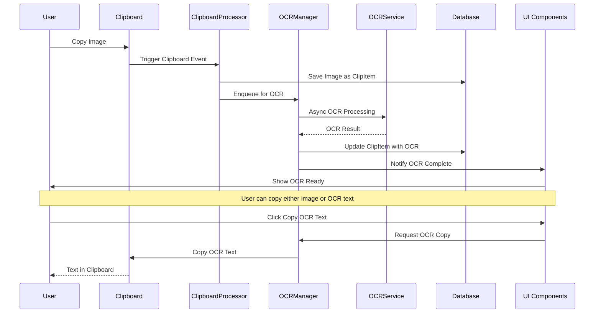
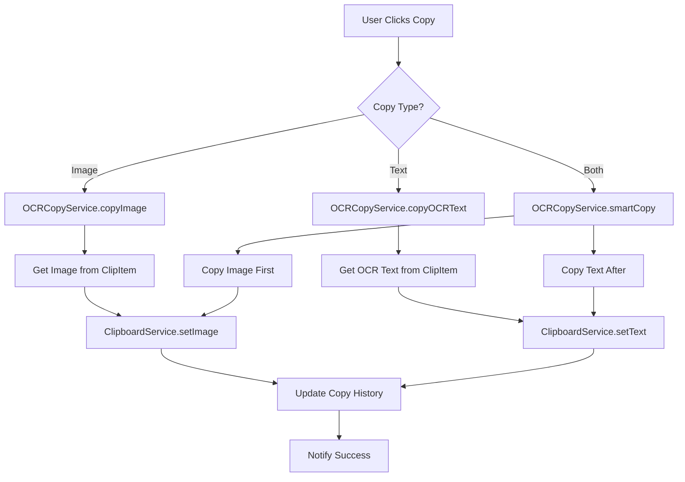
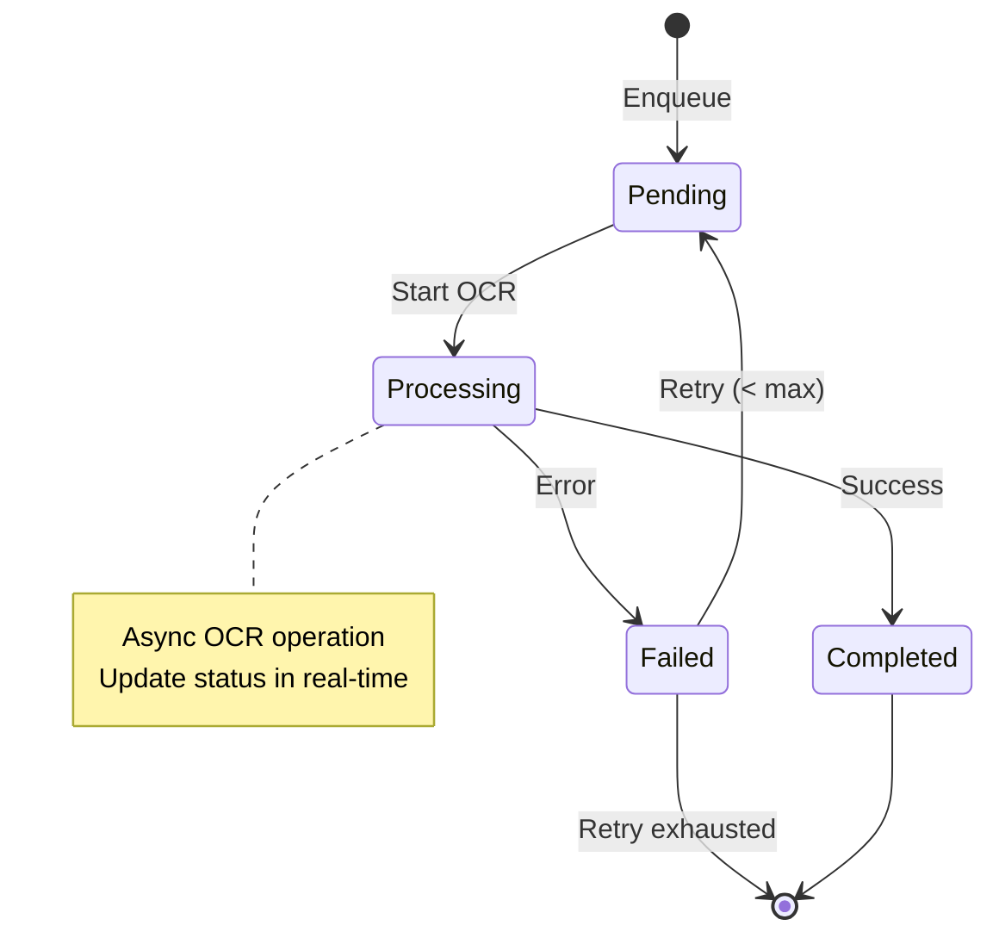
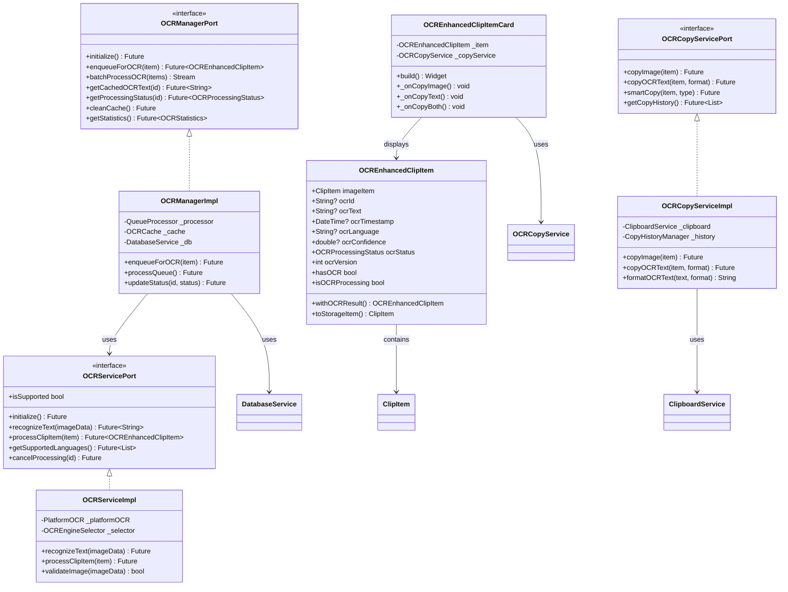

# OCR功能架构设计文档

## 1. 架构概览

### 1.1 核心设计原则

1. **分离关注点**：OCR功能作为独立模块，与现有系统解耦
2. **异步处理**：OCR作为耗时操作，完全异步化，不阻塞主线程
3. **缓存优先**：智能缓存OCR结果，避免重复处理
4. **可扩展性**：支持多OCR引擎、多语言、批量处理
5. **数据一致性**：OCR文本与原图片保持关联，但支持独立操作

### 1.2 架构层级

```
┌─────────────────────────────────────────────────────────────────┐
│                        Presentation Layer                      │
│  ┌─────────────────┐  ┌─────────────────┐  ┌─────────────────┐ │
│  │ ClipItemCard    │  │ OCRStatusWidget │  │ OCRCopyButton   │ │
│  │ with OCR buttons│  │ (processing UI) │  │ (Image/Text)    │ │
│  └─────────────────┘  └─────────────────┘  └─────────────────┘ │
└─────────────────────────────────────────────────────────────────┘
                                │
                                ▼
┌─────────────────────────────────────────────────────────────────┐
│                         Domain Layer                           │
│  ┌─────────────────┐  ┌─────────────────┐  ┌─────────────────┐ │
│  │ OCREnhancedClip │  │ OCRCopyType     │  │ OCRProcessing   │ │
│  │ Item Model      │  │ Enum            │  │ Status Enum     │ │
│  └─────────────────┘  └─────────────────┘  └─────────────────┘ │
└─────────────────────────────────────────────────────────────────┘
                                │
                                ▼
┌─────────────────────────────────────────────────────────────────┐
│                    Service Layer (Core)                        │
│  ┌─────────────────┐  ┌─────────────────┐  ┌─────────────────┐ │
│  │ OCRManager      │  │ OCRService      │  │ OCRCopyService  │ │
│  │ (Queue Mgmt)    │  │ (Processing)    │  │ (Copy Logic)    │ │
│  └─────────────────┘  └─────────────────┘  └─────────────────┘ │
│         │                     │                     │           │
│  ┌─────────────────┐  ┌─────────────────┐  ┌─────────────────┐ │
│  │ Deduplication   │  │ Storage Service │  │ Clipboard       │ │
│  │ Service         │  │ (DB)            │  │ Service         │ │
│  └─────────────────┘  └─────────────────┘  └─────────────────┘ │
└─────────────────────────────────────────────────────────────────┘
                                │
                                ▼
┌─────────────────────────────────────────────────────────────────┐
│                    Platform Layer                              │
│  ┌─────────────────┐  ┌─────────────────┐  ┌─────────────────┐ │
│  │ Native OCR      │  │ Tesseract       │  │ Cloud OCR API   │ │
│  │ (macOS/Win)     │  │ (Linux)         │  │ (Optional)      │ │
│  └─────────────────┘  └─────────────────┘  └─────────────────┘ │
└─────────────────────────────────────────────────────────────────┘
```

## 2. 数据流设计

### 2.1 OCR处理流程



### 2.2 复制流程



### 2.3 队列管理流程



## 3. 类图设计



## 4. 接口集成设计

### 4.1 与现有系统的集成点

1. **ClipboardProcessor集成**
   ```dart
   // 在ClipboardProcessor中添加OCR队列
   Future<void> processClipboardData(dynamic data) async {
     // 现有逻辑...
     final item = await _createClipItem(data);

     // 新增：如果是图片，自动加入OCR队列
     if (item.type == ClipType.image && userPrefs.autoOCR) {
       await _ocrManager.enqueueForOCR(item);
     }
   }
   ```

2. **DeduplicationService增强**
   ```dart
   // 支持OCR文本的去重
   Future<ClipItem?> checkAndPrepare(String contentHash, ClipItem newItem) async {
     // 现有逻辑...

     // 新增：检查OCR文本是否已存在
     if (newItem.ocrText != null) {
       final ocrHash = IdGenerator.generateId(
         ClipType.text,
         newItem.ocrText,
         null,
         {},
       );
       final existingOCR = await _checkOCRExists(ocrHash);
       if (existingOCR != null) {
         // 合并OCR信息
         return _mergeOCRInfo(existing, newItem);
       }
     }
   }
   ```

3. **StorageService扩展**
   ```dart
   // 扩展DatabaseServicePort
   abstract class DatabaseServicePort {
     // 现有方法...

     // 新增OCR相关方法
     Future<void> updateOCRStatus(String id, OCRProcessingStatus status);
     Future<List<ClipItem>> getItemsPendingOCR();
     Future<List<ClipItem>> searchOCRText(String query);
     Future<void> clearOCRCache();
   }
   ```

### 4.2 UI组件集成

```dart
// 扩展现有的ClipItemCard
class ModernClipItemCard extends StatelessWidget {
  @override
  Widget build(BuildContext context) {
    return Card(
      child: Column(
        children: [
          // 现有内容展示...
          _buildImagePreview(),

          // 新增：OCR操作按钮组
          if (widget.item.type == ClipType.image)
            _buildOCRActions(),

          // 新增：OCR文本预览
          if (widget.item.hasOCR && showOCRPreview)
            _buildOCRPreview(),
        ],
      ),
    );
  }

  Widget _buildOCRActions() {
    return Consumer(
      builder: (context, ref, child) {
        final ocrStatus = ref.watch(ocrStatusProvider(widget.item.id));

        return Row(
          children: [
            if (ocrStatus == OCRProcessingStatus.completed)
              OCRCopyButton(
                item: widget.item,
                type: OCRCopyType.text,
                icon: Icons.text_fields,
                label: '复制文本',
              ),
            if (ocrStatus == OCRProcessingStatus.processing)
              OCRProcessingIndicator(itemId: widget.item.id),
            if (ocrStatus == OCRProcessingStatus.pending)
              ElevatedButton(
                onPressed: () => _startOCR(widget.item),
                child: Text('开始识别'),
              ),
          ],
        );
      },
    );
  }
}
```

## 5. 性能优化策略

### 5.1 缓存策略

1. **多级缓存**
   - 内存缓存：最近使用的OCR结果
   - 磁盘缓存：持久化OCR结果
   - 内容哈希：快速查重

2. **缓存失效策略**
   - LRU淘汰：最近最少使用
   - TTL过期：时间到期自动清理
   - 版本控制：OCR结果版本管理

### 5.2 队列优化

1. **优先级队列**
   - 用户主动触发：高优先级
   - 自动OCR：普通优先级
   - 批量处理：低优先级

2. **批处理优化**
   - 合并相同类型图片
   - 并行处理（资源允许）
   - 失败重试机制

### 5.3 数据库优化

1. **索引优化**
   - OCR状态索引
   - OCR文本全文索引
   - 时间戳复合索引

2. **分区策略**
   - 按时间分区历史数据
   - 按状态分区队列数据

## 6. 错误处理和监控

### 6.1 错误处理策略

```dart
// OCR错误类型
enum OCRErrorType {
  unsupportedFormat,  // 不支持的格式
  processingFailed,   // 处理失败
  engineUnavailable,  // OCR引擎不可用
  timeout,           // 超时
  quotaExceeded,     // 配额超限（云OCR）
}

// 错误处理
try {
  final result = await ocrService.processClipItem(item);
} on OCRException catch (e) {
  switch (e.type) {
    case OCRErrorType.processingFailed:
      // 记录错误，加入重试队列
      await _retryManager.scheduleRetry(item);
      break;
    case OCRErrorType.engineUnavailable:
      // 切换备用OCR引擎
      await _switchToFallbackEngine();
      break;
    // ...其他错误处理
  }
}
```

### 6.2 监控指标

1. **性能指标**
   - OCR处理时间分布
   - 队列长度和等待时间
   - 缓存命中率
   - 成功率

2. **业务指标**
   - OCR使用频率
   - 复制行为统计
   - 文本识别准确率
   - 用户偏好分析

## 7. 部署和迁移策略

### 7.1 数据迁移

```sql
-- 迁移脚本：为现有图片添加默认OCR状态
UPDATE clip_items
SET
    ocr_status = 'pending',
    ocr_version = 1
WHERE type = 'image'
AND ocr_status IS NULL;

-- 创建迁移记录
INSERT INTO schema_migrations (version, applied_at)
VALUES ('2024_01_ocr_enhancement', strftime('%s', 'now'));
```

### 7.2 功能开关

```dart
// 功能开关管理
class OCRFeatureFlags {
  static const bool enableOCR = true;           // 总开关
  static const bool autoProcessImages = true;    // 自动处理
  static const bool showOCRPreview = true;      // 显示预览
  static const bool enableCloudOCR = false;      // 云OCR（付费）
  static const bool batchProcessing = true;      // 批处理
}
```

## 8. 测试策略

### 8.1 单元测试

- OCR服务接口测试
- ID生成和去重逻辑
- 队列管理器测试
- 复制服务测试

### 8.2 集成测试

- 端到端OCR流程
- 数据库集成测试
- 剪贴板集成测试
- 多平台OCR测试

### 8.3 性能测试

- 大批量图片处理
- 内存使用监控
- 并发处理测试
- 缓存效率测试